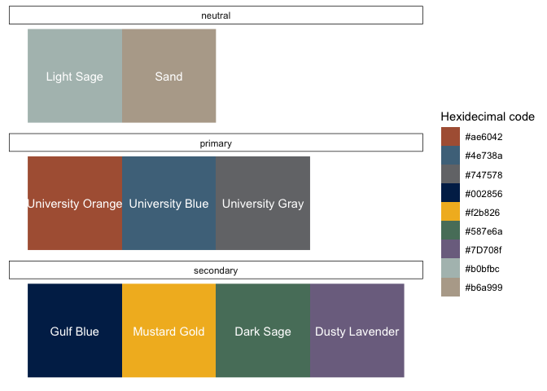
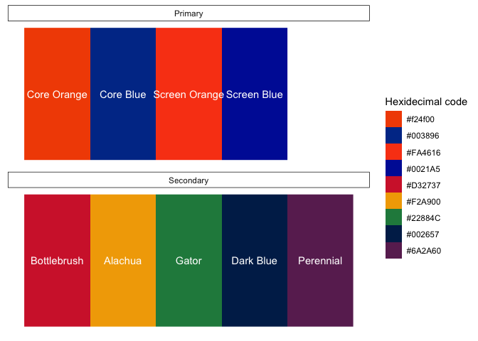

<!-- README.md is generated from README.Rmd. Please edit that file -->

``` r
library(dplyr, warn.conflicts = FALSE)
library(ggplot2)
library(templates)
```

# templates

<!-- badges: start -->
<!-- badges: end -->

Brad Cannell’s templates and themes

## Installation

You can install templates from GitHub with:

``` r
devtools::install_github("brad-cannell/templates")
```

## Rmd templates

The templates package contains several Rmd document templates. They are
located in `inst/rmarkdown/templates`.

## Colors

The templates package contains several color palettes. The easiest way
to access them is from the `my_colors` data frame.

``` r
data(my_colors)
```

``` r
knitr::kable(my_colors)
```

| group       | subgroup  | hex      | description       |
|:------------|:----------|:---------|:------------------|
| bradcannell | primary   | \#000000 | Black             |
| bradcannell | primary   | \#FFFFFF | White             |
| uthealth    | primary   | \#ae6042 | University Orange |
| uthealth    | primary   | \#4e738a | University Blue   |
| uthealth    | primary   | \#747578 | University Gray   |
| uthealth    | secondary | \#002856 | Gulf Blue         |
| uthealth    | secondary | \#f2b826 | Mustard Gold      |
| uthealth    | secondary | \#587e6a | Dark Sage         |
| uthealth    | secondary | \#7D708f | Dusty Lavender    |
| uthealth    | neutral   | \#b0bfbc | Light Sage        |
| uthealth    | neutral   | \#b6a999 | Sand              |
| florida     | primary   | \#f24f00 | Core Orange       |
| florida     | primary   | \#003896 | Core Blue         |
| florida     | primary   | \#FA4616 | Screen Orange     |
| florida     | primary   | \#0021A5 | Screen Blue       |
| florida     | secondary | \#D32737 | Bottlebrush       |
| florida     | secondary | \#F2A900 | Alachua           |
| florida     | secondary | \#22884C | Gator             |
| florida     | secondary | \#002657 | Dark Blue         |
| florida     | secondary | \#6A2A60 | Perennial         |

Here’s a function to help create the color plots below.

``` r
color_plots <- function(.group) {
  df <- my_colors %>% 
    filter(group == .group) %>% 
    group_by(subgroup) %>% 
    mutate(x = row_number()) %>% 
    ungroup() %>% 
    mutate(hex = factor(hex, hex, hex))
  
  ggplot(df, aes(x = x, y = 1, fill = hex)) +
    geom_raster() +
    geom_text(aes(label = description), color = "white") +
    facet_wrap(vars(subgroup), ncol = 1) +
    scale_fill_manual("Hexidecimal code", values = as.character(df$hex)) +
    theme(
      # Remove background
      panel.background = element_rect(fill = "transparent"),
      panel.grid.major = element_blank(),
      panel.grid.minor = element_blank(),
      plot.background  = element_rect(fill = "transparent"),
      
      # Remove x axis
      axis.title.x = element_blank(),
      axis.text.x  = element_blank(),
      axis.ticks.x = element_blank(),
      
      # Remove y axis
      axis.title.y = element_blank(),
      axis.text.y  = element_blank(),
      axis.ticks.y = element_blank(),
      
      # Facet labels
      strip.background = element_rect(color = "black", fill = "transparent")
    )
}

# For testing
# color_plots("uthealth")
```

### Brad Cannell color palette

Currently, the bradcannell color palette only contains black and white.
There is no need to “show” it.

### UTHealth color palette

``` r
color_plots("uthealth")
```



### Florida color palette

``` r
color_plots("florida")
```



## Images

The templates package contains several logos and images. They are
located in `man/figures`. Here is a sample.

### Brad Cannell


## R4Epi


## Hex Stickers


## UTHealth


