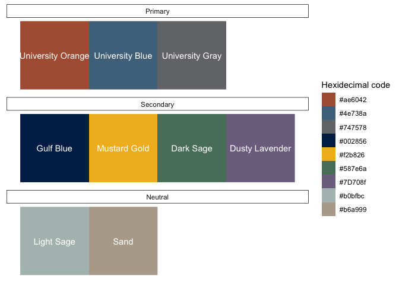

<!-- README.md is generated from README.Rmd. Please edit that file -->

``` r
library(dplyr, warn.conflicts = FALSE)
library(ggplot2)
library(EWBTemplates)
```

# EWBTemplates

<!-- badges: start -->
<!-- badges: end -->

Templates and themes for Epi-Workbench.

## Installation

You can install templates from GitHub with:

``` r
devtools::install_github("epi-workbench/EWBTemplates")
```

## Template files

The EWBTemplates package template files for things like creating coding
lessons. The template files are located in `inst/templates`.

## Colors

The EWBTemplates package contains several color palettes. The easiest
way to access them is from the `ewb_colors` data frame.

``` r
data(ewb_colors)
```

``` r
knitr::kable(ewb_colors)
```

| group | subgroup  | hex      | description |
|:------|:----------|:---------|:------------|
| ewb   | Primary   | \#4E5F72 | Dark Blue   |
| ewb   | Primary   | \#FFD662 | Yellow      |
| ewb   | Secondary | \#28A745 | Green       |
| ewb   | Secondary | \#6C757D | Gray        |
| ewb   | Accent    | \#FD7E14 | Orange      |

### EWB color palette

``` r
ewb_colors |> color_plots("ewb")
```



## Images

The EWBTemplates package contains several logos and images. They are
located in `man/figures`. Here is a sample.


