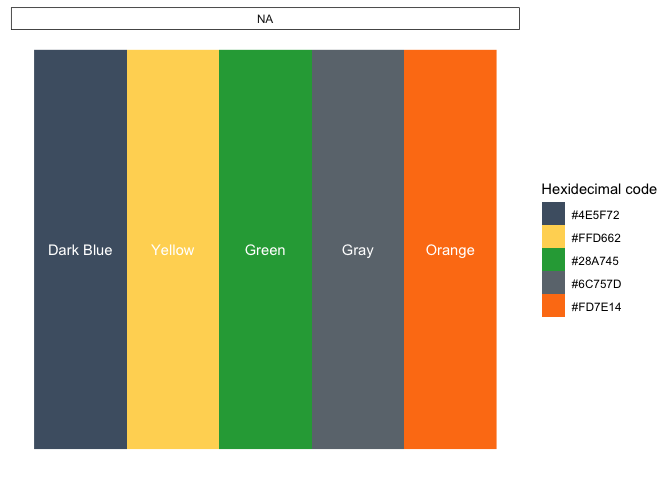

<!-- README.md is generated from README.Rmd. Please edit that file -->

``` r
library(dplyr, warn.conflicts = FALSE)
library(ggplot2)
library(EWBTemplates)
```

# EWBTemplates

<!-- badges: start -->
<!-- badges: end -->

Templates and themes for Epi-Workbench.

## Installation

You can install templates from GitHub with:

``` r
devtools::install_github("epi-workbench/EWBTemplates")
```

## Template files

The EWBTemplates package template files for things like creating coding
lessons. The template files are located in `inst/templates`.

Additionally, this package contains **RStudio addins** to make loading
template files even easier. The code for the addins are located in
`inst/extdata`, `inst/rstudio`, and `R/`.

## Colors

The EWBTemplates package contains several color palettes. The easiest
way to access them is from the `ewb_colors` data frame.

``` r
data(ewb_colors)
```

``` r
knitr::kable(ewb_colors)
```

| group | subgroup | hex      | description |
|:------|:---------|:---------|:------------|
| ewb   | NA       | \#4E5F72 | Dark Blue   |
| ewb   | NA       | \#FFD662 | Yellow      |
| ewb   | NA       | \#28A745 | Green       |
| ewb   | NA       | \#6C757D | Gray        |
| ewb   | NA       | \#FD7E14 | Orange      |

Here’s a function to help create the color plots below.

``` r
color_plots <- function(.group) {
  df <- ewb_colors %>% 
    filter(group == .group) %>% 
    group_by(subgroup) %>% 
    mutate(x = row_number()) %>% 
    ungroup() %>% 
    mutate(hex = factor(hex, hex, hex))
  
  ggplot(df, aes(x = x, y = 1, fill = hex)) +
    geom_raster() +
    geom_text(aes(label = description), color = "white") +
    facet_wrap(vars(subgroup), ncol = 1) +
    scale_fill_manual("Hexidecimal code", values = as.character(df$hex)) +
    theme(
      # Remove background
      panel.background = element_rect(fill = "transparent"),
      panel.grid.major = element_blank(),
      panel.grid.minor = element_blank(),
      plot.background  = element_rect(fill = "transparent"),
      
      # Remove x axis
      axis.title.x = element_blank(),
      axis.text.x  = element_blank(),
      axis.ticks.x = element_blank(),
      
      # Remove y axis
      axis.title.y = element_blank(),
      axis.text.y  = element_blank(),
      axis.ticks.y = element_blank(),
      
      # Facet labels
      strip.background = element_rect(color = "black", fill = "transparent")
    )
}

# For testing
# color_plots("ewb")
```

### EWB color palette

``` r
color_plots("ewb")
```



## Images

The EWBTemplates package contains several logos and images. They are
located in `man/figures`. Here is a sample.


